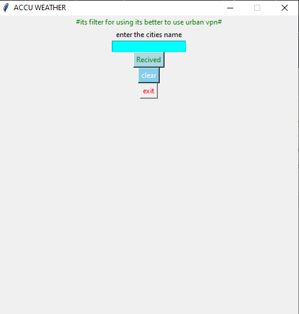

# It is an old weather app i wrote it for my university project.

<p> It is exe file you can pull and use it</p>
<p>The code is inside it and you can use the code</p>
<p> The UI and UX in this is not great and it is old so it can be changed with tkinter</p>

> [!IMPORTANT]  
> This app would not work for you so first you should do these

Go to this site
```
https://www.accuweather.com/
```
then Register and create an account for yourself.
after you create an account go to
```
my app
```
create and app and then you will receive an APIKEY.
copy it.
```
http://dataservice.accuweather.com/forecasts/v1/daily/1day/YOUR_APIKEY
```
copy paste this in the code then use it.


---
## 🎨UI


---

## 👨‍💻Used Technologies
- Requests
- python
- tkinter
- pyinstaller
